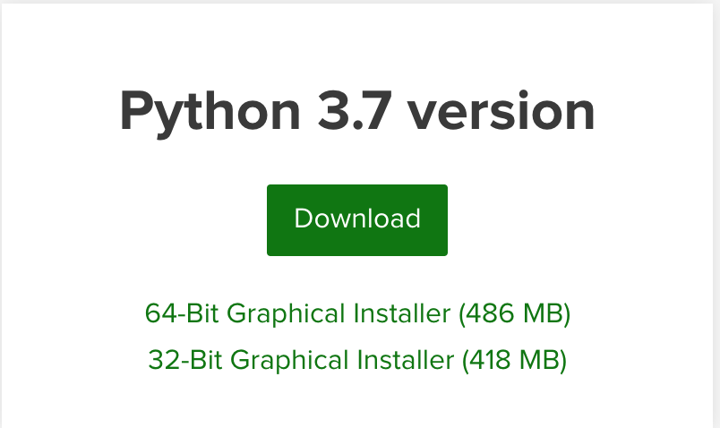

# NB01: Getting you started with notebooks

## What is the Jupyter Notebook? 

Jupyter Notebooks (JN) are interactive development interfaces that can use multiple programming languages. They are eventful and lively digital documents that allow you to combine `live code`, `code outputs`, `narrative text`, `visualizations` and even `interactive widgets` in one place. Sounds like a useful medium to create and share self explanatory dynamic documents for your work right?

Keep in mind that Jupyter Notebooks are just one of the outer layers of the planet JUPYTER. It is founded by Fernando Perez in 2014 to support interactive data science and scientific computing across all programming languages through open source software. You can read [this Wiki](https://en.wikipedia.org/wiki/Project_Jupyter) for more information on `Project Jupyter`. 

The name Jupyter is an acronym for 3 programming languages (**Ju**lia-**Pyt**hon-**R**). Today about 100 languages are accessible via JN! Off all the languages a JN can support, `Python` constitutes the backbone of its core technology. **Therefore, to have JN, first you need to have Python installed on your personal computer.**  

Depending on your operating system, there are several ways of installing Python. For this course, we will stick with one of the most famous Python distributions: `Anaconda`. It is cross platform compatible and comes with several Jupyter tools, including JN. 

### STEP-1: Install Anaconda 
***

> Note: If you already have Anaconda installed, you can skip this step.

Visit [the offical Anaconda website](https://www.anaconda.com/distribution/) and select your operating sytem from the selection tab that looks like this: 


Next, download the **Python 3.7 version** graphical installer for your OS. Please pay attention to choose the correct option (32 or 64 bit) for your PC:



Graphical installer will guide you through neccesary steps to complete the installation.

### STEP-2: Download or `Clone` the Notebooks repository
*** 

#### Option-1: Download 

You can [use this link](https://github.com/FINKI-Research-methodology-in-ICT/Notebooks/archive/master.zip) to download zip file that contains all the available content of `FINKI-Research-methodology-in-ICT/Notebooks`. Extract them to a location of your choice.  

#### Option-2: Clone

If you don't know how to use `git`, you may want to refer to to this [joyful webpage](https://swcarpentry.github.io/git-novice/). 

If you are comfortable with using `git`, open a terminal, navigate to a folder where you would like to place `FINKI-Research-methodology-in-ICT/Notebooks` repository. Next, run the following: 

```
git clone https://github.com/FINKI-Research-methodology-in-ICT/Notebooks.git
```
Congrats! You've cloned the repository. You can stay up-to-date with the changes made to the repository by the instructors by simply `git pull`. 

### STEP-3: Open the first JN  
*** 

The first notebook is the most bare-bones example, allowing you to discover JN features via Python packages that comes with your `Anaconda` installation. Follow these steps to open this notebook: 

**i) Make sure that anaconda is installed properly and the `base` environment is activated.**

Open the `Anaconda Terminal` (Windows) or your default terminal (Unix users) and run the following command: 

```
conda env list
```

You should see a symbol (*) next to the `base` environment:


> Note: If you already know how to work with Anaconda environments, do not forget switching to the `base` by running `source activate base` command. 

**ii) Navigate to the directory where you have the `FINKI-Research-methodology-in-ICT/Notebooks` repository and open the notebook**

The `...` part in the following command MUST be replaced with the corresponding directory on your PC:

```
cd .../Notebooks/NB01
ls
```

After running the `ls` command, you should be able to see the list of files stored in the `NB01` directory, where `HelloWorld.ipynb` notebooks is located. 

Run the following command to open `HelloWorld.ipynb` notebook: 

```
jupyter notebook HelloWorld.ipynb
```

The command above should open the notebook in your default web browser (e.g. Chrome or Firefox). By default notebooks are run on `http://localhost:8888/`. If your notebook is not opened automatically, visit `http://localhost:8888/` on your web browser, and copy paste the `token` appears on your terminal to the text box to open the notebook: 

> `Token` is the long hash followed by `token=` in the following example: 


**iii) Discover the notebook**

Follow the instructions on the `HelloWorld.ipynb` notebook. 

*** 


Create a new Python 3.6 env: 

```
conda create -n datvis36 python=3.6 anaconda
```

Activate it:

```
source activate datvis36 
```

Clone this repository and navigate into it:
```
git clone https://github.com/agahkarakuzu/datavis_edu.git
cd datavis_edu
```

Install requirements: 
```
pip install -r requirements.txt
```
Installation of the packages defined by `postBuild` script may change from OS to OS. If you are on Ubuntu `./postBuild` should do the trick. If you are on OSX or Windows, just copy paste the whole content to your terminal. 

You are ready to go! Start your favorite Jupyter interface (ensure that you are in repo): 

```
jupyter notebook 
OR
jupyter lab
```

